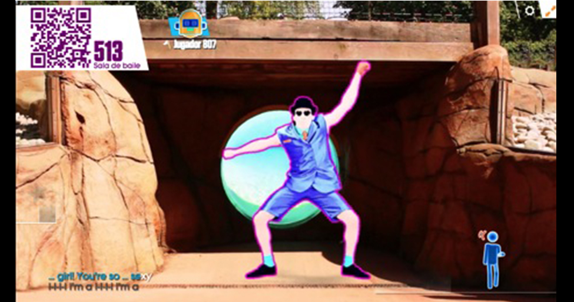

# Sporty Kids

## Descubrimiento e Investigación

### User Research:
#### Problemática inicial:

Falta de actividad física en los niños.

#### Datos estadísticos

La obesidad infantil es el principal problema de salud pública del país, por sus implicancias presentes, pero especialmente por las consecuencias futuras en las principales enfermedades que nos afectan, como son la diabetes, cáncer, enfermedades cardiovasculares, osteoarticulares y degenerativas, con un alto costo para el país. Además, se ha comprobado que la obesidad infantil impacta en el rendimiento escolar y la salud mental de los estudiantes.

Según los índices de la OMS, se recomiendan 60 minutos de actividad moderada o vigorosa para escolares y adolescentes, todos los días de la semana. En Chile 7 de cada diez niños no cumple con estos estándares, mientras que en adolescentes, son 8 de cada diez.

[Fuente](http://www.activehealthykidschile.com/wp-content/uploads/2017/04/Reporte-Actividad-F%C3%ADsica-Infantil-Chile.pdf "Actividad física infantil Chile").

#### Conclusiones entrevista niños y profesora:

Tras realizar entrevistas con niños pequeños (de 6 a 11 años), descubrí que los niños en su tiempo libre realizan actividad física de distinta índole pero en tramos cortos, a menos que realicen un taller (la mayoría no asiste a talleres). La mayoría de los niños maneja celular y computador y los ocupan también en su tiempo libre. La principal actividad que les gusta a la mayoría de niños y niñas es jugar, ya sea videojuegos, ver televisión y ambos comparten el gusto por realizar coreografías o bailes, los cuales los realizan solos o acompañados por amigos o hermanos.

Al conversar con una profesora de educación física pude acotar más al usuario, ya que las actividades de los niños pequeños se pueden clasificar etariamente por rangos de 6 a 8 años y de 8 a 10 años. Para este caso de estudio me enfocaré en los niños de 8 a 12 años, los cuales no tienen grandes diferencias por el género, vale decir los niños y niñas realizan el mismo tipo de actividades motoras, sus motivaciones son explorar su cuerpo y el desarrollo de la motricidad motora gruesa, reconocimiento de su cuerpo en general. En cuanto a la motivación, los niños pequeños necesitan desafíos y recompensas, y un tono en el lenguaje que desafie sus propias capacidades, no como una orden sino con un tono de “puedes realizar esto o aquello”.

[Link a entrevistas niños: ](https://drive.google.com/open?id=1GXLUzrHwTPrPRG8KOGoRcGxBckHlbLqLgerTXCceWL4 "Actividad física infantil Chile").

[Link a entrevista profesora: ](https://docs.google.com/document/d/1ebSVCGMC7u8uIfjiQSMcPBQg5upiGO0Vf4Ya5TtgLvw/edit?usp=sharing).

#### Aplicaciones relacionadas con el movimiento

##### Just Dance Now

En esta aplicación la persona imita a modo de espejo los movimientos con el teléfono en la mano. Se conecta el celular mediante código QR con una tablet o computador que tiene la “sala” de danza. Si bien es una aplicación para adultos, existen niños que suelen ocuparlas.

##### Toca Dance

En esta aplicación se pueden indicar los pasos y realizar los pasos que uno indica para realizar la coreografía, tiene la opción de vestir a los personajes además de indicar sus movimientos. Básicamente son videos que el niño debe repetir.

##### Fitness para niños - Yoga

Interfaz bastante minimalista, los niños realizan las poses en un determinado tiempo. Son tiempos cortos de atención. El usuario principal es un niño o niña de 6 a 8 años 

La búsqueda de aplicaciones para niños que los incitan a moverse fue prácticamente nula (Salvo las aplicaciones indicadas anteriormente), la mayoría de aplicaciones encontradas para niños son para estimular aspectos cognitivos pero no físicos. 

## Ideación

Para responder a la problemática se hizo una aplicación movil de un juego que consiste en realizar etapas de ejercicio. El primer nivel, que es el más básico consistió en ejercicios de equilibrio (debido a lo dificil de ilustrar los movimientos sólo se trabajó este). Para ello se trabajó con ilustraciones, donde la historia principal se trata de un personaje que debe llegar a un castillo. La aplicación invita a superar retos para que el personaje vaya avanzando.

## Testing

### Test Primer prototipo con niños

Para poder ver a los niños en acción, decidí realizar un testeo inicial con un prototipo de alta fidelidad (Ya que los niños respoden a colores, formas e interacción con objetos). En esta primera experiencia realizada con niños de 6-7 años observé que a los niños de esta edad les cuesta entender instrucciones escritas, por lo que no pudieron navegar la aplicación mobil. Sin embargo al testearlo con un niño de 12 años, el niño siguió las instrucciones. Esta primera aproximación sirvió para enfocarme en un publico objetivo de mayor edad, el límite inicial del próximo testeo sería de 8 a 12 años.

Se Puede ver los videos de los primeros testeos [aqui](https://drive.google.com/open?id=1FM_uCleKgskhrmwTxsY4WpL3nfbqH6lB).

### Test Segundo prototipo con niños desde 8 años

Al probarlo con niños de mayor edad obtuve mayor respuesta a la aplicación, sin embargo algunos niños no entendieron las instrucciones del juego, o sólo miraron sin repetir los movimientos, es por ello que se tuvo que cambiar el texto de las instrucciones de la aplicación, además apretaban lugares de la pantalla que no correspondían.

Se Puede ver los videos de los segundos testeos [aqui](https://drive.google.com/open?id=1JtM4NYkIVgeZh2-x2472ZeqpLtEng7Gj).

## Prototipado

Se Puede ver el prototipo final de la aplicación [aqui](https://marvelapp.com/30abhhd).

